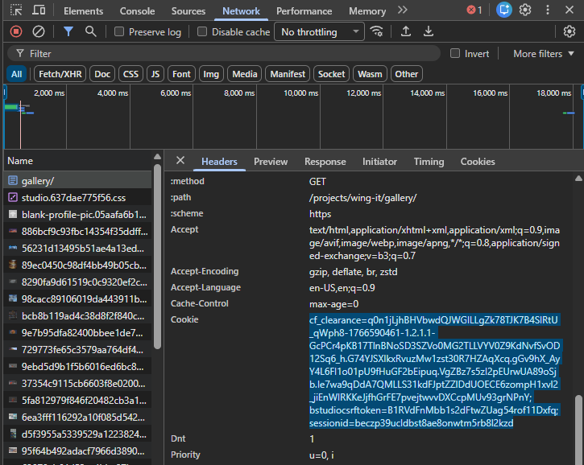

## CG Production Asset Downloader

### Batch download open source assets from Blender Studio

This script can be used to batch download assets from Blender Studio. While their assets are open source, Blender asks that you have a subscription to Blender Studio to download files. If you intend to use this script, please be sure to get a subscription to support the work being done byBlender. [Blender Studio](https://studio.blender.org/)

This script is not affiliated with Blender or Blender Studio. All assets downloaded are created by Blender Studio and available under the [Creative Commons Attribution 4.0 International](https://creativecommons.org/licenses/by/4.0/) license.

## Usage

1. Follow the instructions in download_assets.py to set the USER_COOKIE.
2. Set the GALLERY_URL to the gallery you want to download assets from.
3. Set the DOWNLOAD_DIR to the directory you want to download assets to.
4. Run the script.

